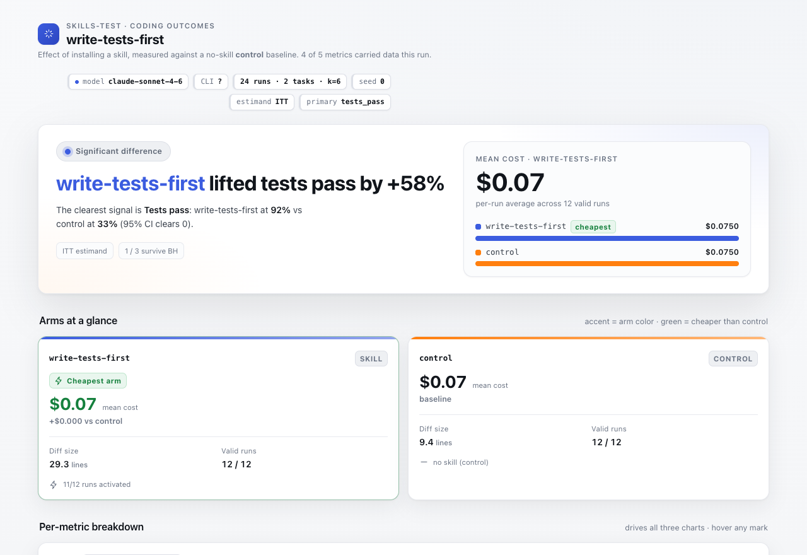
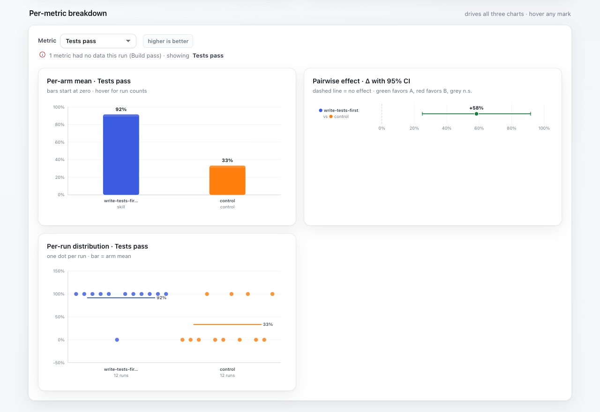
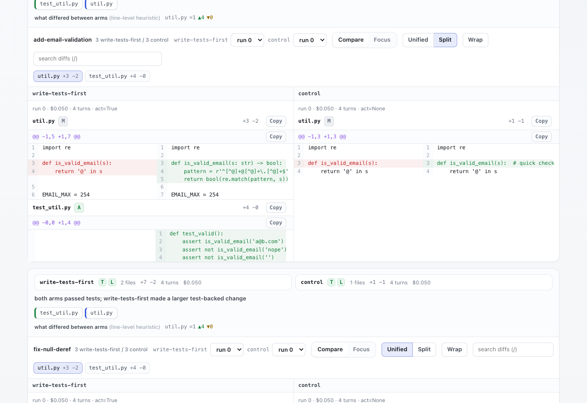
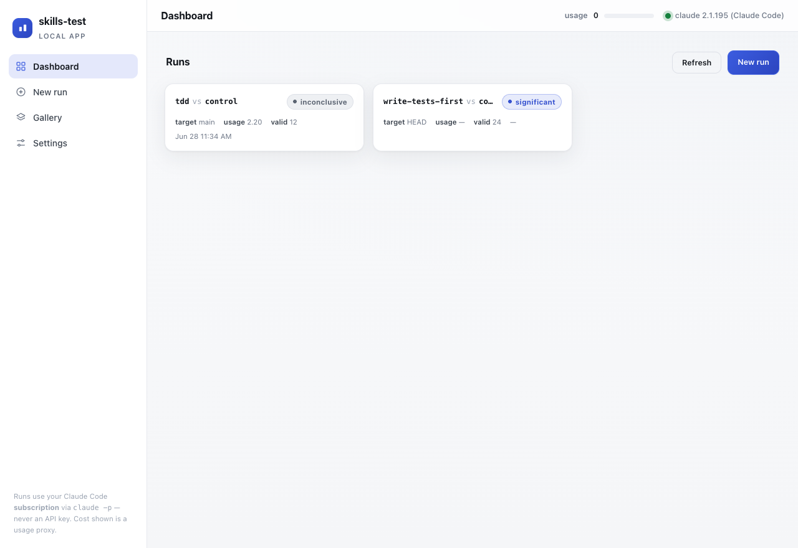
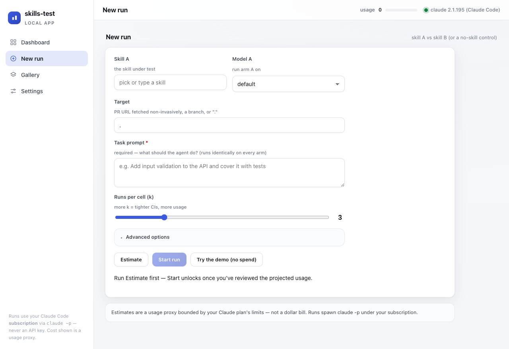
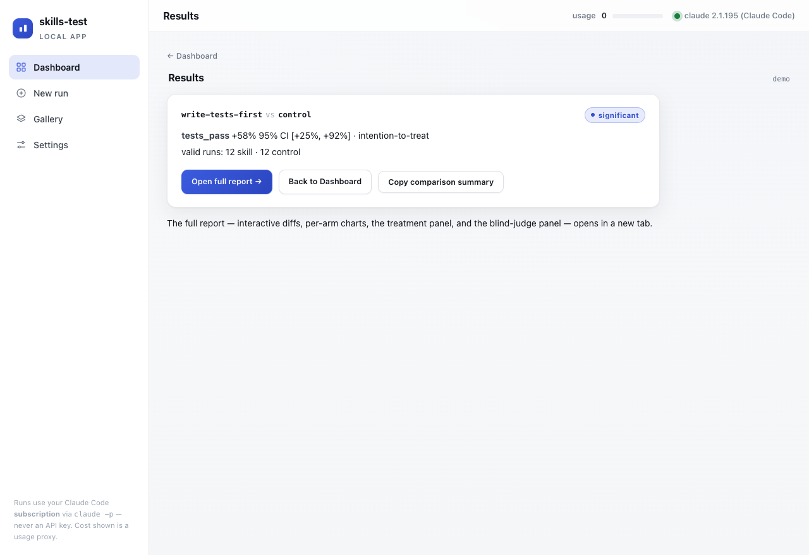

<div align="center">



<p><strong>Does that Claude Code skill, model, or CLI actually make your agent code better?</strong></p>

<p>
  <a href="https://github.com/beardwhocodes/skills-test/actions/workflows/lint-test.yml"></a>
  <a href="LICENSE"></a>
  
  
</p>

<p>
  <a href="#what-it-does">What it does</a> &nbsp;·&nbsp;
  <a href="#how-it-works">How it works</a> &nbsp;·&nbsp;
  <a href="#quickstart">Quickstart</a> &nbsp;·&nbsp;
  <a href="#the-local-app">The local app</a> &nbsp;·&nbsp;
  <a href="#methodology">Methodology</a>
</p>

</div>

---

## What it does

A skill *feels* like it helped because you saw one good diff. That's an anecdote, not evidence. **skills-test** runs the same coding task many times with the thing under test **on vs off**, scores the results deterministically, and reports an **effect size with a confidence interval** — so "it helped" becomes a number, or an honest *inconclusive*.

|  |  |
| --- | --- |
| 🔬 &nbsp;**Controlled A/B** | Same task, same model, same prompt — the *only* thing that differs is the skill. Each arm runs `k` times in its own isolated git worktree. |
| 📊 &nbsp;**Honest statistics** | Cluster bootstrap CI + permutation p-value + Benjamini–Hochberg. A "significant" result is impossible to fake on an underpowered or contaminated run. |
| 🧩 &nbsp;**Skill, model, *or* CLI** | A/B a skill, the same skill under two models (sonnet vs opus), or two whole agent CLIs (claude vs codex). |
| 👀 &nbsp;**The diff is the point** | An interactive, offline report puts the code each arm actually wrote side by side — word-level diffs, per-arm charts, and an opt-in blind judge. |

> The independent variable is whether the skill's `SKILL.md` is present. Everything else — base commit, model, prompt, permission policy — is held constant. It measures the effect of *shipping the skill*, not a cherry-picked best run.

---

## How it works

```
preflight ─→ tasks × {skill on, skill off} × k runs ─→ isolated git worktree per run
   │                                                          │
   │                                         claude -p edits it (your subscription)
   ▼                                                          ▼
quarantine flaky/red checks                       deterministic scorers
                                            tests · lint · build · diff size · cost
                                                          │
                                                          ▼
                            cluster bootstrap CI · permutation p · Benjamini–Hochberg
                                                          │
                                                          ▼
                              interactive HTML report
```

Each run is scored on five deterministic metrics; the difference between arms is reported as an effect size with a 95% confidence interval.

| Metric | Measures |
| --- | --- |
| `tests_pass` | test suite passes (primary endpoint) |
| `lint_pass` | lint passes |
| `build_pass` | build passes |
| `diff_lines` | lines of code changed |
| `cost_usd` | per-run usage proxy |

---

## The interactive report

`skills-test demo` renders a self-contained `report.html` — **zero `claude` calls, zero cost** — so you can see exactly what a result looks like before spending anything. No CDN, no JS deps, light + dark themes.

**Per-metric charts** — per-arm means, a pairwise-effect forest plot (Δ with 95% CI), and a per-run distribution, all driven by one metric selector:

<div align="center"></div>

**The diff viewer** — the code each arm actually produced, side by side, with word-level highlighting, a file rail, search, a minimap, and Compare / Focus / Unified / Split modes. This is the part you came for: *why* did the skill change the outcome?

<div align="center"></div>

---

## The local app

`skills-test serve` is a self-contained local web app (stdlib only — no framework, no CDN, no build) that wraps the engine end to end. It runs on **your Claude Code subscription** via `claude -p` — never an API key or the Agent SDK; the "cost" shown is a usage proxy bounded by your plan's limits. The server binds to `127.0.0.1` only and gates every route behind a per-process session token plus Host/Origin checks.

**A dashboard of past runs** — each card shows the comparison and its verdict at a glance:

<div align="center"></div>

**A guided new-run form** — pick a skill from a searchable list of your installed plugins/skills, choose models or an agent CLI for each arm, and get a **usage estimate before anything spends** (Start stays locked until you've reviewed it). Try it with zero spend via *Run the demo*:

<div align="center"></div>

**A results view** — a native comparison summary (effect + CI), a one-click **Copy comparison summary** (clean markdown, no token), and a link into the full interactive report:

<div align="center"></div>

The live view (not shown) streams the agent's work in real time — a cell grid, console, and usage ticker — and there's an optional *Stop after ~$N* soft cap on total usage.

---

## Quickstart

> Requires **Python 3.11+** and `git` + the `claude` CLI on your PATH. Zero Python dependencies — it's one stdlib-only module.

```bash
# Try it in one command — offline, free, no claude calls:
uvx skills-test demo            # or: python3 skills_test.py demo

# Scaffold a config for your own repo + skill, project the cost, then run it:
skills-test init                # writes skillab.toml, pre-filled from your repo + skills
skills-test plan -c skillab.toml --cost-per-run 0.30   # project usage + minimum detectable effect (no spend)
skills-test run  -c skillab.toml --html report.html    # the experiment + an HTML report

# Or launch the local app:
skills-test serve               # http://127.0.0.1:7878
```

### One-liner: `skills-test quick A B TARGET`

The fast path, no config file. Name two skills (the second can be `none` for skill-vs-control) and point at a PR, branch, or directory:

```bash
skills-test quick resolve-pr-parallel resolve-pr-comments https://github.com/owner/repo/pull/7044
skills-test quick my-skill none .       --prompt "Add input validation to the API"
```

It resolves each skill by name (project → `~/.claude/skills` → installed plugins), resolves the target (for a PR it fetches the head into a private ref — it never touches your working tree), then runs the experiment + judge + HTML report.

### Commands

| Command | What it does |
| --- | --- |
| `demo` | Offline, free example report — zero `claude` calls |
| `init` | Scaffold a `skillab.toml` from your repo |
| `plan` | Dry-run cost/time projection + minimum-detectable-effect (no spend) |
| `run` | Run the experiment (`--resume` reuses prior runs; `--from-github <url>` clones a skill repo) |
| `report` | Re-render an HTML report from a `results.jsonl` (no spend) |
| `serve` | Launch the local web app |
| `quick` | The no-config one-liner head-to-head |
| `ci` | Run + gate with a policy exit code (for CI) |

---

## Compare models or whole CLIs

**Two models, one skill** — set a different model per arm (e.g. `my-skill @ sonnet` vs `my-skill @ opus`) to isolate the model's contribution.

**Two agent CLIs** — point an arm at a different CLI with the per-arm `runner_*` fields. `codex` is a built-in preset; any other value is a raw command template (`{prompt_file}` — the prompt is passed by file, never interpolated into the shell).

```toml
[experiment]
repo_path  = "."
base_ref   = "main"
skill_src  = "./.claude/skills/my-skill"
skill_name = "my-skill"
runner_b   = "codex"          # arm B is the codex CLI instead of claude + skill
include_control = false       # pure A-vs-B; drop the third no-skill arm
k = 6
```

> A cross-CLI pair is **confounded by construction** — it bundles the CLI binary, its default model, prompt handling, and a separate login with any skill effect. The report downgrades it to **"suggestive"** (never a confident verdict) and shows a banner spelling out the confound. The blind judge — which reads only the code each side produced — gives the cleanest read.

Set `skill_b_src` / `skill_b_name` to pit **two skills head to head**: the experiment runs three arms (skill A, skill B, control) and reports every pairwise comparison.

---

## Methodology

The estimand is deliberate, and the report is built so it can be **cited, not just screenshotted** (see [`METHODOLOGY.md`](METHODOLOGY.md)):

- **Primary = intention-to-treat.** Every clean on-run vs every clean off-run, *regardless* of whether the skill fired. This measures the effect of *shipping* the skill — the actual independent variable.
- **Activation is a diagnostic, not a gate.** Filtering on-runs to only-activated ones would condition on a post-treatment outcome (collider bias). Activation rate is reported separately; a per-protocol number exists but is labeled secondary/biased.
- **Cluster bootstrap, not flat.** Resample tasks, then runs-within-task, so correlated runs from one task can't inflate significance. Needs ≥2 tasks for real cross-task variance.
- **Contamination is exclusion, not conditioning.** A foreign (globally-installed) skill firing on the control arm invalidates that run — that's exposure validity, kept separate from the outcome.
- **Multiple metrics** get a Benjamini–Hochberg correction; `tests_pass` is the single pre-registered primary endpoint.
- **The blind judge** (opt-in) compares the on/off diffs with arm labels stripped, judging every pair in *both* orderings to cancel position bias, and reports a win-rate with its own cluster-bootstrap CI in a section marked non-deterministic.

---

## Architecture

Three stdlib-only Python modules (≥3.11) — no framework, no CDN, no build step. The engine ships as a single file so `uvx skills-test` is a zero-install one-liner:

```
skills_test.py            engine + CLI + HTML report  (one file, standard library only)
  ├─ experiment runner    isolated git worktree per run · claude -p (your subscription)
  ├─ scorers              tests · lint · build · diff size · cost   (deterministic)
  ├─ statistics           cluster bootstrap CI · permutation p · Benjamini–Hochberg
  ├─ blind judge          opt-in LLM diff comparison, position-bias canceled
  └─ HTML report          offline dashboard: hero · hand-built SVG charts · diff viewer

skills_test_server.py     local web-app backend (http.server + SSE)  — `skills-test serve`
skills_test_app.py        the single-file SPA (vanilla JS, no build)
```

Every run writes `results_dir/{results.jsonl, manifest.json, summary.json}` — a portable, schema-versioned record (`results.schema.json`) you can re-render or diff later. The `summary.json` is the substrate for the badge-free verdict, the CI gate, and the static gallery.

---

## Tests

```bash
python3 test_skills_test.py          # engine: statistics + activation detector
python3 test_skills_test_server.py   # local app: token auth, Host/Origin, runner refusal
```

Stdlib-only, no `claude` / `git` / network required. A free `ruff` + test gate runs on every push.

---

## License

[MIT](LICENSE) © Josh Tomaino. See [`CLAUDE.md`](CLAUDE.md) for design rationale, the estimand, and open work.
